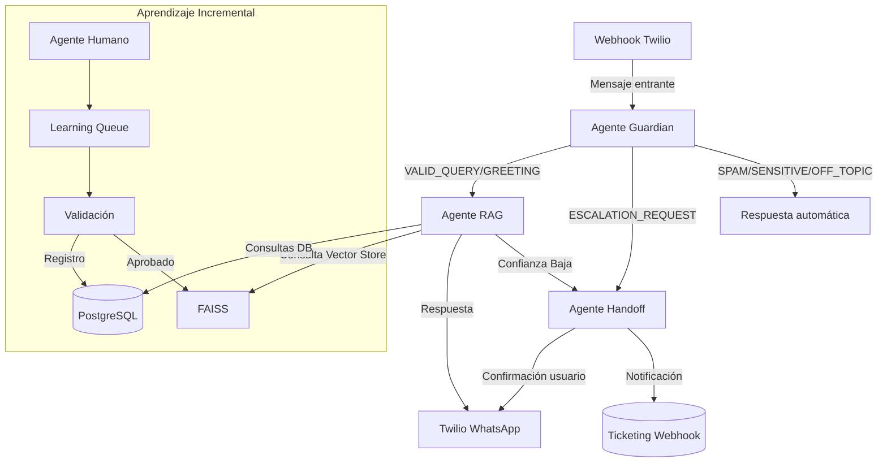

# WhatsApp AI Agent Multi-Agente

## Diagrama de Arquitectura

### Resumen de agentes
- **Agente Guardian**: Clasifica el mensaje, detecta spam y decide el flujo inicial.
- **Agente RAG**: Recupera contexto con embeddings, genera la respuesta y decide si escalara.
- **Agente Handoff**: Registra la escalación, notifica al usuario y dispara el webhook de ticketing.

## Instalación sin Docker
1. Crear entorno virtual y activar.
2. `pip install -r requirements.txt`
3. Configurar variables de entorno (ver `.env.example`).
4. Ejecutar `python scripts/setup.py` para crear tablas.
5. (Opcional) `python scripts/load_documents.py` para cargar documentos base.
6. Iniciar API: `uvicorn main:app --reload`.

## Instalación con Docker
1. Copiar `.env.example` a `.env` y completar valores.
2. `docker compose up --build`.

## Carga de documentos iniciales
- Añadir archivos Markdown en `data/documents/`.
- Ejecutar `python scripts/load_documents.py` o usar endpoint `POST /admin/knowledge-base`.

## Testing
- Ejecutar `pytest`.

## Variables de entorno clave
- `OPENAI_API_KEY`, `WHATSAPP_ACCOUNT_SID`, `WHATSAPP_AUTH_TOKEN`, `WHATSAPP_FROM_NUMBER`, `WEBHOOK_BASE_URL`, `WHATSAPP_WEBHOOK_SECRET`.

## Guía de Despliegue
- Deploy en Railway/Render: construir imagen con Dockerfile, configurar variables de entorno, montar volumen para `data/vector_store`.
- Configurar webhook de Twilio apuntando a `/webhook/twilio`.
- Asegurar seguridad con HTTPS y secret del webhook.

## Casos de prueba ejemplo
1. "¿Cuál es el precio del Plan Profesional?" → VALID_QUERY
2. "Hola 👋" → GREETING
3. "Necesito hablar con un humano ahora" → ESCALATION_REQUEST
4. "asdfasdf" → SPAM
5. "Pásame tu contraseña" → SENSITIVE
6. "¿Cuál es el horario?" → VALID_QUERY
7. "Mándame memes" → OFF_TOPIC
8. "Quiero cancelar" → VALID_QUERY
9. "zzz" → SPAM
10. "Esto es sobre política" → OFF_TOPIC
