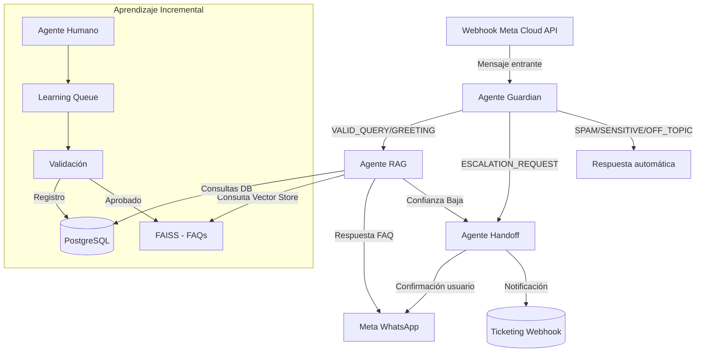

# WhatsApp AI Agent - CubreJardin FAQ Bot

Multi‑agente construido sobre FastAPI para responder preguntas frecuentes de clientes de CubreJardin vía WhatsApp utilizando la **Meta WhatsApp Cloud API**. La solución combina recuperación aumentada (RAG), escalaciones controladas y fallbacks automáticos con plantillas aprobadas.

## Pruebas Recomendadas

### Preguntas Frecuentes

1. **Ubicación**: "¿De dónde son ustedes?" → responde sobre reparto en Santiago y Concón
2. **Regiones**: "¿Envían a regiones?" → explica opciones para envío fuera de Santiago
3. **Instalación**: "¿Ustedes instalan?" → información sobre servicio de instalación
4. **Pedido Mínimo**: "¿Cuál es el despacho mínimo?" → responde $40.000 + despacho
5. **Paisajismo**: "¿Hacen paisajismo?" → ofrece servicio de jardines
6. **Otros Productos**: "¿Qué otros cubresuelos venden?" → refiere a <www.cubrejardin.cl>
7. **Comprar Web**: "¿Puedo comprar en la página?" → explica que la web es muestrario
8. **Pago**: "¿Cómo puedo pagar?" → transferencia o efectivo contra entrega
9. **Hacer Pedido**: "¿Cómo hago el pedido?" → explica proceso por WhatsApp

### Preguntas sobre Tiqui Tiqui

10. **Info General**: "Quiero info del tiqui tiqui" → envía información completa con precio y características
11. **Conejos**: "¿Se lo comen los conejos?" → explica experiencia con conejos
12. **Sombra**: "¿Lo puedo poner a la sombra?" → responde que es pleno sol
13. **Sobre Pasto**: "¿Puedo ponerlo arriba del pasto?" → explica preparación del terreno
14. **Mezclar con Pasto**: "¿Puedo mezclarlo con el pasto?" → desaconseja la mezcla
15. **Precio**: "¿Qué precio tiene el tiqui tiqui?" → $690 por planta, 10 por m2
16. **Cobertura**: "Quiero cubrir 20 m2" → calcula cantidad y precio total

### Otros Comandos

17. **Saludo**: "Hola" → categoría `GREETING`
18. **Sensibles**: "Realízame una transferencia" → categoría `SENSITIVE`
19. **Spam**: "asdfasdf" → categoría `SPAM`
20. **Escalación**: "Necesito hablar con un humano" → disparará `handoff_notification` y `pass_thread_control`
21. **Fuera de ventana**: reenvía el mismo mensaje después de 24 h → se envía plantilla `session_expired`

---

## Arquitectura



### Componentes Principales

- **Webhook Meta** (`api/webhooks.py`): valida firma `X-Hub-Signature-256`, idempotencia por `message_id`, marca mensajes como leídos y delega al orquestador.
- **Agente Guardian** (`agents/guardian_agent.py`): clasifica mensajes (VALID_QUERY, SPAM, SENSITIVE, etc.) aplicando reglas explícitas para fraudes y solicitudes financieras.
- **Agente FAQ** (`agents/faq_agent.py`): identifica preguntas frecuentes y genera respuestas manteniendo el tono y estilo exacto de las respuestas originales.
- **Agente RAG** (`agents/rag_agent.py`): recupera contexto desde FAISS con las FAQs y responde. Loguea confianza (`rag_answer`) y fuentes.
- **Agente Handoff** (`agents/handoff_agent.py`): notifica al usuario, envía plantilla y ejecuta `pass_thread_control` cuando corresponde.
- **TemplateService** (`services/template_service.py`): fallback automático fuera de la ventana de 24 h usando plantillas aprobadas (`session_expired`, `handoff_notification`, etc.).
- **WhatsAppService** (`services/whatsapp_service.py`): cliente async para la Cloud API v21.0 con backoff, validación SHA-256 y tracking de la última interacción.
- **Persistencia**: Postgres (SQLAlchemy/InMemory) para conversaciones y cola de aprendizaje, FAISS para embeddings de FAQs, Redis para futuros workers (cola de mensajes).

### Componentes Clave

- **Webhook Meta** (`api/webhooks.py`): valida firma `X-Hub-Signature-256`, idempotencia por `message_id`, marca mensajes como leídos y delega al orquestador.
- **Agente Guardian** (`agents/guardian_agent.py`): clasifica mensajes (VALID_QUERY, SPAM, SENSITIVE, etc.) aplicando reglas explícitas para fraudes y solicitudes financieras.
- **Agente RAG** (`agents/rag_agent.py`): recupera contexto desde FAISS y responde. Loguea confianza (`rag_answer`) y fuentes.
- **Agente Handoff** (`agents/handoff_agent.py`): notifica al usuario, envía plantilla y ejecuta `pass_thread_control` cuando corresponde.
- **TemplateService** (`services/template_service.py`): fallback automático fuera de la ventana de 24 h usando plantillas aprobadas (`session_expired`, `handoff_notification`, etc.).
- **WhatsAppService** (`services/whatsapp_service.py`): cliente async para la Cloud API v21.0 con backoff, validación SHA-256 y tracking de la última interacción.
- **Persistencia**: Postgres (SQLAlchemy/InMemory) para conversaciones y cola de aprendizaje, FAISS para embeddings, Redis para futuros workers (cola de mensajes).

---

## Requisitos

- Python 3.12+
- Docker / Docker Compose (opcional)
- Cuenta de Meta WhatsApp Cloud API con número configurado
- Clave válida de OpenAI (usa `text-embedding-3-small` + `gpt-4o-mini`)

---

## Variables de Entorno

Configura `.env` a partir de `.env.example`.

| Variable | Descripción |
| --- | --- |
| `OPENAI_API_KEY` | Clave de OpenAI |
| `WHATSAPP_PHONE_NUMBER_ID` | ID del número en Meta |
| `FACEBOOK_PAGE_ACCESS_TOKEN` | Token permanente de Meta |
| `FACEBOOK_APP_SECRET` | Se usa para validar la firma del webhook |
| `FACEBOOK_TARGET_APP_ID` | App objetivo para handover (por defecto Page Inbox) |
| `WHATSAPP_WEBHOOK_VERIFY_TOKEN` | Token usado en la verificación inicial de Meta |
| `DEFAULT_TEMPLATE_NAME` | Plantilla por defecto para fuera de ventana (ej. `session_expired`) |
| `TEMPLATE_MAPPING` | JSON con mapeos `intención → plantilla` (ej. `{ "handoff": "handoff_notification" }`) |
| `WEBHOOK_BASE_URL` | URL pública (ngrok / dominio) |
| `MERCADO_FIEL_API_URL` | URL base de la API de Mercado Fiel (para gestión de stock) |
| `MERCADO_FIEL_API_KEY` | Token de autenticación para Mercado Fiel API |
| `DATABASE_URL` | (Docker Compose) URL para Postgres |
| `REDIS_URL` | (Docker Compose) URL para Redis |

> **Tip:** no expongas credenciales en repositorios ni logs.

---

## Instalación Local (sin Docker)

```bash
python3 -m venv .venv
source .venv/bin/activate
pip install -r requirements.txt

# Carga documentos a FAISS
python scripts/load_documents.py

# Levanta la API
uvicorn main:app --reload
```

- Ejecuta pruebas: `pytest`
- Simulación CLI: `python scripts/test_conversation.py`

---

## Instalación con Docker

```bash
cp .env.example .env  # completa valores reales
docker compose up --build
```

Servicios levantados:

- `api` (FastAPI + uvicorn)
- `db` (Postgres 15)
- `redis` (Redis 7)

Carga documentos desde el host (con el contenedor en marcha):

```bash
docker compose exec api bash -lc 'python scripts/load_documents.py'
```

---

## Configuración del Webhook en Meta

1. Exponer el servicio (ej. `ngrok http 8000`).
2. En Meta Business Manager → WhatsApp → Configuration → Webhook:
   - URL: `https://<tu-dominio>/webhook/whatsapp`
   - Verify token: `WHATSAPP_WEBHOOK_VERIFY_TOKEN`
   - Suscribe eventos `messages` y `message_status`.
3. Registra las plantillas aprobadas (`session_expired`, `handoff_notification`, etc.) en el mismo panel.

---

## Flujo End-to-End

1. **Mensaje entrante** llega desde Meta al webhook `/webhook/whatsapp`.
2. Se valida la firma (`X-Hub-Signature-256`) y se descarta si ya se procesó (`message_id`).
3. Guardian clasifica (logs `guardian_classification`).
4. RAG responde o, si la confianza `<0.5`, se escalona (logs `rag_answer` muestran la confianza y las fuentes consultadas).
5. Fuera de la ventana de 24 h salta `OutsideMessagingWindowError`, se envía la plantilla definida por el `TemplateService` y queda trazado en `template_fallback_sent`.
6. Las conversaciones se almacenan con metadata: `confidence`, `sources`, `message_id`, `last_interaction_at`.

---

## Cómo Ver la Confianza de Cada Respuesta

- **Logs**: busca entradas `rag_answer` en `docker compose logs -f api`.
- **Base de datos** (Postgres):

  ```sql
  SELECT id, message, metadata->>'confidence' AS confidence
  FROM conversation
  WHERE role = 'assistant'
  ORDER BY id DESC LIMIT 5;
  ```

---

## Scripts Útiles

| Script | Descripción |
| --- | --- |
| `scripts/load_documents.py` | Ingresa todos los Markdown en `data/documents/` al vector store y DB |
| `scripts/test_conversation.py` | Simulación interactiva del flujo completo (usa stubs locales) |
| `scripts/setup.py` | Placeholder (no-op) para compatibilidad en entornos legacy |

---

## Ejemplos de Consultas

### Preguntas Frecuentes Generales

- `¿De dónde son ustedes?` - Información sobre ubicación y cobertura
- `¿Envían a regiones?` - Opciones de envío fuera de Santiago
- `¿Ustedes instalan?` - Servicio de instalación
- `¿Cuál es el despacho mínimo?` - Pedido mínimo y costos
- `¿Hacen paisajismo?` - Servicios de diseño de jardines
- `¿Qué otros cubresuelos venden?` - Catálogo de productos
- `¿Puedo comprar en la página?` - Proceso de compra
- `¿Cómo puedo pagar?` - Métodos de pago

### Preguntas sobre Tiqui Tiqui

- `Quiero info del tiqui tiqui` - Información completa del producto
- `¿Se lo comen los conejos?` - Experiencia con mascotas
- `¿Lo puedo poner a la sombra?` - Requisitos de luz solar
- `¿Puedo ponerlo arriba del pasto?` - Preparación del terreno
- `¿Qué precio tiene?` - Precio y cálculo por metros
- `Quiero cubrir 20 metros cuadrados` - Cálculo de cantidad y presupuesto

### Consultas Generales

- `Hola` - Saludo (categoría `GREETING`)
- `¿Cuánto cuesta el tiqui tiqui?` - Consulta de precios via RAG
- `Realízame una transferencia` - Mensaje sensible (categoría `SENSITIVE`)
- `Necesito hablar con un humano` - Escalación a agente humano

---

## Observabilidad

- Logging estructurado con `structlog` (JSON) para integrarse con cualquier stack.
- Eventos claves: `whatsapp_message_received`, `guardian_classification`, `rag_answer`, `template_fallback_sent`, `whatsapp_pass_thread_control`.
- Para tracing distribuido / métricas se recomienda integrar OpenTelemetry (pendiente en backlog).

---

## Aprendizaje Incremental

1. Las respuestas humanas se guardan en la tabla `LearningQueueEntry`.
2. Valida y publica con `POST /admin/learning/{entry_id}/validate` (o mediante scripts personalizados).
3. Corre `python scripts/load_documents.py` o tu pipeline ETL para reindexar FAISS.

---

## Estado Actual y Backlog

- ✅ Migración completa desde Twilio a Meta Cloud API.
- ✅ Enforcement de ventana de 24 h con fallback a plantillas.
- ✅ Idempotencia de webhooks por `message_id`.
- ✅ Logging de confianza y fuentes por respuesta.
- 🔜 Integrar cola de mensajes (Redis/RQ/Celery) para envío asíncrono.
- 🔜 Instrumentación OpenTelemetry para tracing/métricas.
- 🔜 Botones interactivos generados por el RAG y manejo de callbacks.

---

## Licencia

Ver archivo `LICENSE`.
